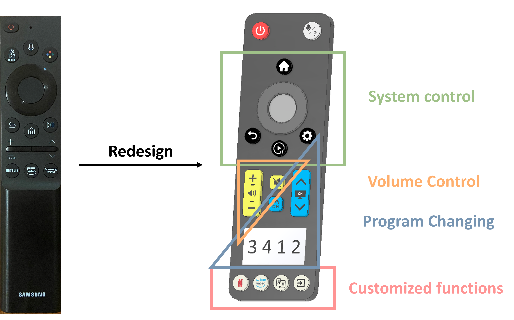
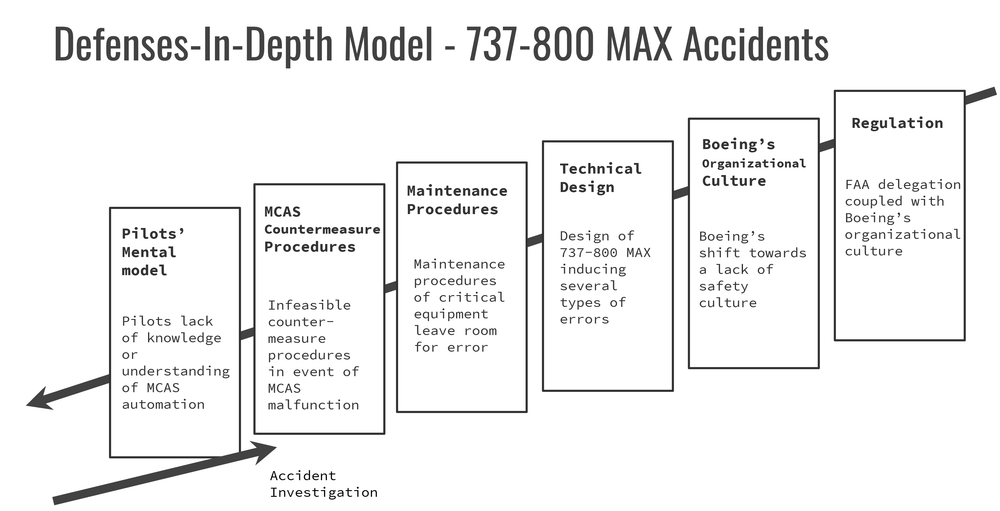
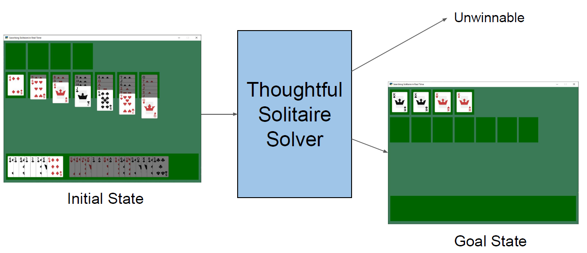
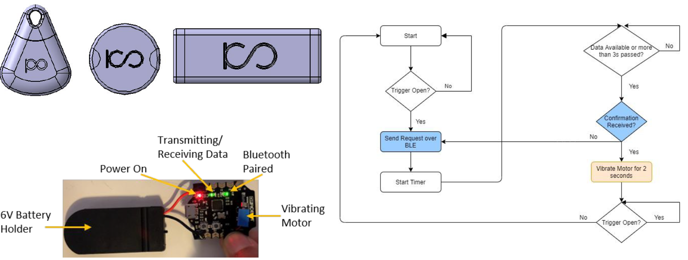
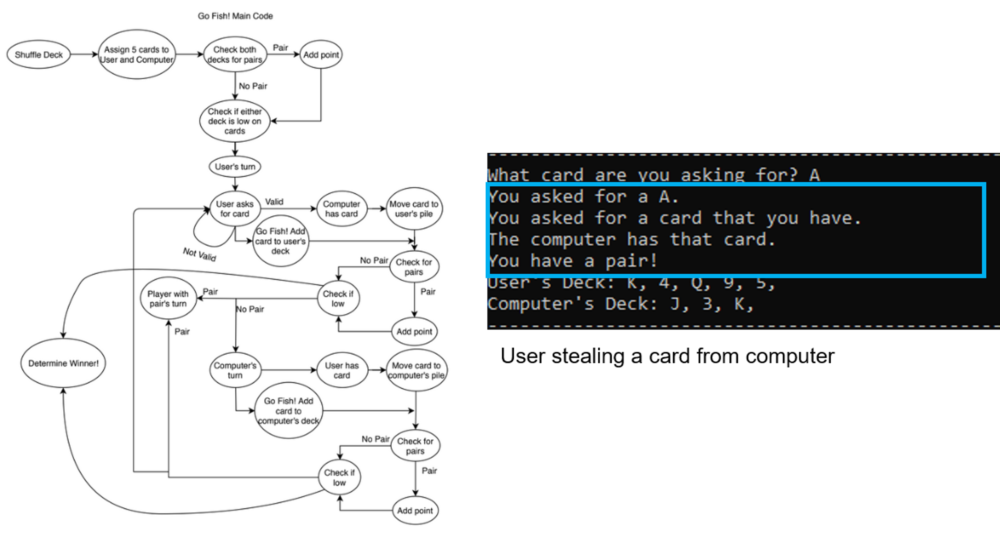
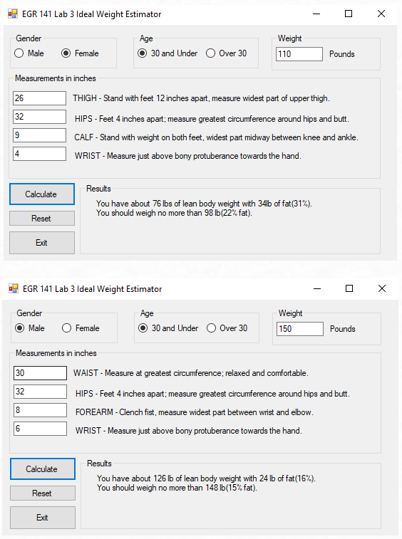
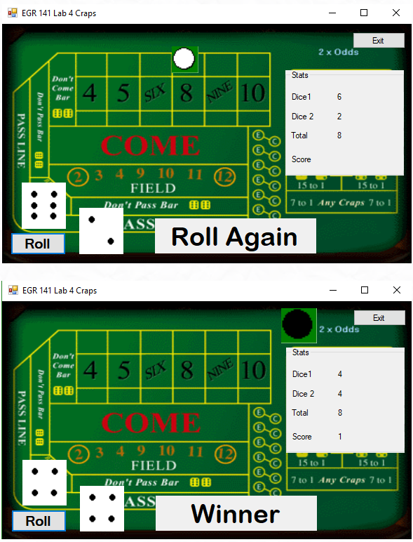
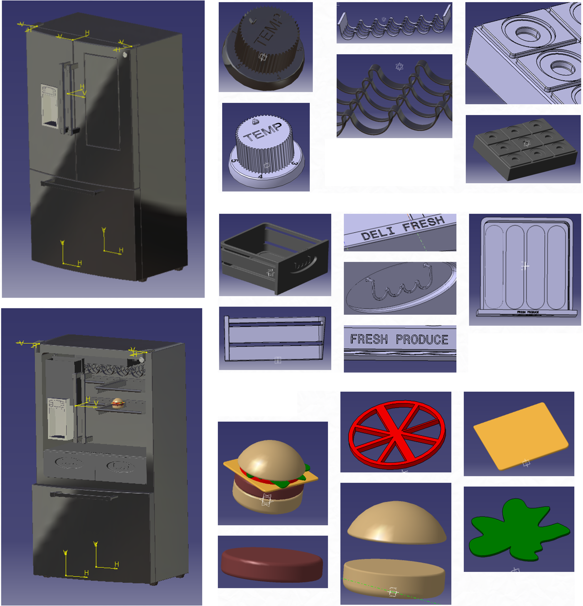

### University of Michigan relevant courses

- ROB 501, Math for Robotics
- ROB 550, Robotic Systems Lab
- ROB 535, Self-Driving Cars
- EECS 592, Foundations of Artifical Intelligence
- EECS 560, Linear Systems Theory
- IOE 465, Design and Analysis of Experiments
- IOE 434, Human Error and Complex System Failures
- IOE 536, Cognitive Ergonomics and Human Systems Integration
- IOE 570, Experimental Design

---

### Oakland University relevant courses

- EGR 120, Engineering Graphics and CAD
- EGR 141, Computer Problem Solving
- EGR 2800, Design and Analysis of Electromechanical Systems
- CSE 230, Object-Oriented Computing I
- CSI 2209, Intro to Data Stuctures in C
- CSI 3640, Computer Organization
- ECE 2700, Digital Logic Design
- ECE 3710, Computer Hardware Design
- ECE 4720, Microprocessor-based System Design
- ECE 4510, Machine Vision
- ECE 4500, Robotic Systems and Control
- ECE 4999, Senior Design
- MIS 4460, Business Analytics
- MIS 4500, Web Analytics
- MIS 4470, Practical Computing and Data Analytics

---

#### IOE 536

#### Cognitive Ergonomics and Human Systems Integration

#### University of Michigan

Evolutionary Redesign of a Samsung TV Remote Control: My team and I conducted cognitive task analyses involving structured interviews, surveys, and concurrent think-aloud verbal protocols and utilized three sets of design heuristics to uncover how people use this Samsung TV remote. We then redesigned this Samsung TV remote to support a cognitive triad relationship between users’ goals, the abilities of the TV remote, and the world/environment in which actions are performed.

---

#### IOE 434

#### Human Error and Complex Systems Failure

#### University of Michigan

Case Study of the Boeing 737-800 MAX Airplane: My team and I investigated the Lion Air (2018) and Ethiopian Airlines (2019) crashes involving the Boeing 737-800 MAX to determine organizational, regulatory, and technical factors that contributed to these airplane crashes. We analyzed changes implemented because of these airplane crashes and provided further recommendations for consideration to decrease the opportunity of future airplane crashes.

---

#### EECE 592

#### Foundations of Artificial Intelligence

#### University of Michigan

Searching Solitaire in Real-Time: My team and I developed a thoughtful solitaire solver in Python to autonomously solve games or determine they are unwinnable using heuristic functions and action pruning to understand game search methods and improve the win percentage (accuracy) of winnable games. I coded for pattern recognition to prune actions early that would result in an unwinnable game state and to terminate game play as quickly as possible for unwinnable games to improve the functionality of the solver.

---

#### IOE 465

#### Design and Analysis of Experiments

#### University of Michigan

Evaluating the Effects of Feedback and Trial Length on Performance: I investigated the effects of positive and negative feedback on performance and subjective ratings of performance during ten trials of the PEBL tracking test to understand the relationship between feedback and performance. I conducted exploratory data analysis and ran mixed-design ANOVA and paired-sample t-tests in SPSS for statistical significance to determine the importance of the results.

---

#### ECE 4999

#### Senior Design (Project Manager)

#### Oakland University

For my senior design project, a small wearable safety device was designed in a discreet bracelet/keychain design targeted toward college/university students with a company sponsor. The device is a way to alert others that you are in a potentially dangerous situation and need help. For example, the device could be used if you are being attacked, robbed, followed, need medical attention, or any other situation in which you feel uncomfortable. The device is intended to be worn as a piece of jewelry or as a keychain. The device could be attached to one’s wrist, belt loop, backpack, or other clothing aspect. By pulling on the strap of the device, the battery is pulled into place to complete the circuit. The device then uses Bluetooth Low Energy to communicate with the user's phone to send a text message or call to a predefined contact list, where preferences can be altered through the phone application. As the project manager, I disseminated tasks to my nine-member team to ensure close adherence to the timeline and budget. I also presented weekly updates and regularly communicated with the project sponsors and course professors.

---

#### ECE 4510

#### Machine Vision

#### Oakland University

Falling is one of the greatest threats to the health of patients, especially in nursing homes and hospitals. There is no easy solution to preventing falls but response time to a fall is critical. A computer vision-based fall detection system is capable of limiting these fall related injuries while also protecting patient privacy. This project uses a deep neural net trained on the MPII Human Pose Dataset to find keypoints on a human body. These keypoints allow for the determination of the body orientation, and specifically the angle that the torso makes with the vertical edge of the frame. This angle is used to categorize the subject as standing, possible slip, or slipped. The appropriate text and color are displayed on the live video frame. In the case that a fall has been detected, a text message is sent to a phone indicating that someone may need immediate attention. This vision system can enable medical professionals and caretakers to respond to falls quickly and identify hazardous areas.

---

#### ECE 4720

#### Microprocessor-based System Design

#### Oakland University

Simulation of Common Automotive Features: The objective of this project is to demonstrate various automotive features using readily available on-board and external sensors with the HCS12 microcontroller. The motivation behind the project was to understand how existing technologies work in vehicles today, as this will help in understanding where improvements could be made for future-production vehicles. This project effectively simulates vehicle features such as vehicle-to-vehicle (V2V) communication, adaptive headlights, climate control, and cruise control. V2V communication is accomplished using two Dragon-12 boards with the serial peripheral interface (SPI) communication protocol. Each microcontroller represents a vehicle and the two vehicles communicate about properly executing a lane change. The liquid crystal display (LCD) is used to print out the action each vehicle is currently undertaking. For the adaptive headlights, a photoresistor uses analog-to-digital conversion (ADC) to control the brightness of a light-emitting diode (LED). This represents automatic adjusting of a vehicle’s headlights as a response to lighting conditions. For climate control, a temperature sensor uses ADC and PWM to control an externally connected fan. This is to represent automatic cooling inside a vehicle as a response to temperature conditions. For cruise control, a linear potentiometer uses ADC and PWM to control an externally connected DC motor. A dip switch is utilized to either fix the DC motor speed to the current potentiometer input, or to return control of the speed back to the user. The DC motor is to represent the rotation of the wheels on a vehicle and the potentiometer represents the gas pedal.

---

#### ECE 3710

#### Computer Hardware Design

#### Oakland University

Tones from Keyboard and Temperature Sensor: The purpose of this project is to communicate and interface with sensors that will result in tones being generated on the mono audio output and through a buzzer. The hardware for this project consists primarily of a USB standard keyboard, the temperature sensor, a buzzer, and the mono audio output present on the Nexys 4 DDR board. With the use of a switch, the user will be able to choose between generating tones using the keyboard or using the temperature sensor. Another switch is used to choose between the buzzer and the mono audio output. While using the keyboard, a unique tone will be heard for fifteen different keys, with a sixteenth variation of no tone. A qualifying key that generates a tone will appear across all four seven-segment displays, with no tone and nothing appearing across the seven-segment display for all other keys. For the temperature sensor, one of sixteen tones will be generated based off the current temperature reading. This can be heard through the buzzer or the mono audio output. The major finding is that a USB keyboard uses PS/2 for communication and the temperature sensor uses I2C for communication. These communication protocols and manufacturer specifications require carefully implemented finite state machines. The conclusions clearly indicate that different data communication protocols are powerful tools to interface with sensors and to drive outputs. Recommendations to the user include thorough testing of both the keyboard and the temperature sensor.

---

#### ECE 2700

#### Digital Logic Design

#### Oakland University

Banner and Scrolling Messages on Seven-Segment Displays: The purpose of this project is to design and implement finite state machines with a datapath circuit that will primarily interface with all eight seven segment displays on the Nexys 4 DDR board. With the use of switches, the banner on the display will move in a forward or backward direction, or display one of two scrolling messages.  Switches will also be used in order to choose one of four speeds at which the banner flows. Furthermore, the user can active the stop switch to freeze the current pattern across the seven segment displays. The major findings are that the banner on the seven segment displays is accomplished with the use of several hardware components controlled by finite state machines, including four speed counters, multiplexers, 7-bit registers, 56-bit parallel access shift registers, and a serializer consisting of another finite state machine, a decoder, and a multiplexer. The conclusions clearly indicate that a datapath circuit controlled by finite state machines is a powerful method in the design of digital systems. Recommendations to the user include thorough testing of all switches controlling speed and the banner pattern or message selection.

---

#### CSI 2209

#### Intro to Data Stuctures in C

#### Oakland University

My final project was on the popular card game Go Fish!. ​This project is a simulation of the classic children’s card game Go Fish! using Microsoft Visual Studio and C. The objective of the game is to form as many pairs of cards of the same number as possible. Whoever has more pairs of cards at the end between the user and the computer is the winner. The user and the computer are each dealt five cards to start the game. The user and computer take turns asking each other for a specific card or drawing from the Go Fish! pile. The code automatically handles shuffling the deck, checking for pairs, determining whose turn it is, validating cards that are asked for, transferring cards between the user’s deck, the computer’s deck, and the Go Fish! pile

---

#### EGR 2800

#### Design and Analysis of Electromechanical Systems

#### Oakland University

​My team and I developed a fully functional lockbox display case. The case holds a secret object that is meant for display only. Such a case uses an ultrasonic distance sensor to gauge the relative distance of an approaching user, and signals the system accordingly. If the user passes a certain threshold, the LEDs will turn red and increase in intensity as the user's distance to the lockbox decreases. Once the user gets too close to the secret object, the system enters lockdown mode. An alarming sound plays through the peizo buzzer. A stepper motor mounted to a pulley system is used to automatically close the lid. A servo motor is used to latch and lock the lid, thus securing the secret object. To disengage the alarm and to reopen the box, the user must enter the correct passcode on a keypad. Additionally, the user can reset the passcode after entering the correct passcode. This project is built entirely with Arduino. My contribution to this project is testing the limits of these needed devices, and developing all of the code for proper functionality.

---

#### EGR 141

#### Computer Problem Solving

#### Oakland University

These are some of the projects that I constructed in Visual Basic. The ideal weight estimator takes inputs based on gender. Using this information, along with an age threshold and current weight, the lean body weight and fat percentage are computed. Then, the user gets their ideal weight. The body fat is measured by measuring the amount of subcutaneous fat, which is directly beneath the skin. It should be noted that if the ideal weight is less than the user's current weight, the solution may not be to lose weight, but to gain muscle.

The Craps game is a fully-functional casino version of craps. The dice are rolled by the click of a button, and the values of the dice and the total are displayed under the stats bar. The white and black markers are capable of moving to the proper location on the board based on the dice roll. The score is kept track of until the player either wins or loses, at which point a new game begins.

---

#### EGR 120

#### Engineering Graphics and CAD

#### Oakland University

Below are some refrigerator parts that I have designed in CATIA V5. 

---
