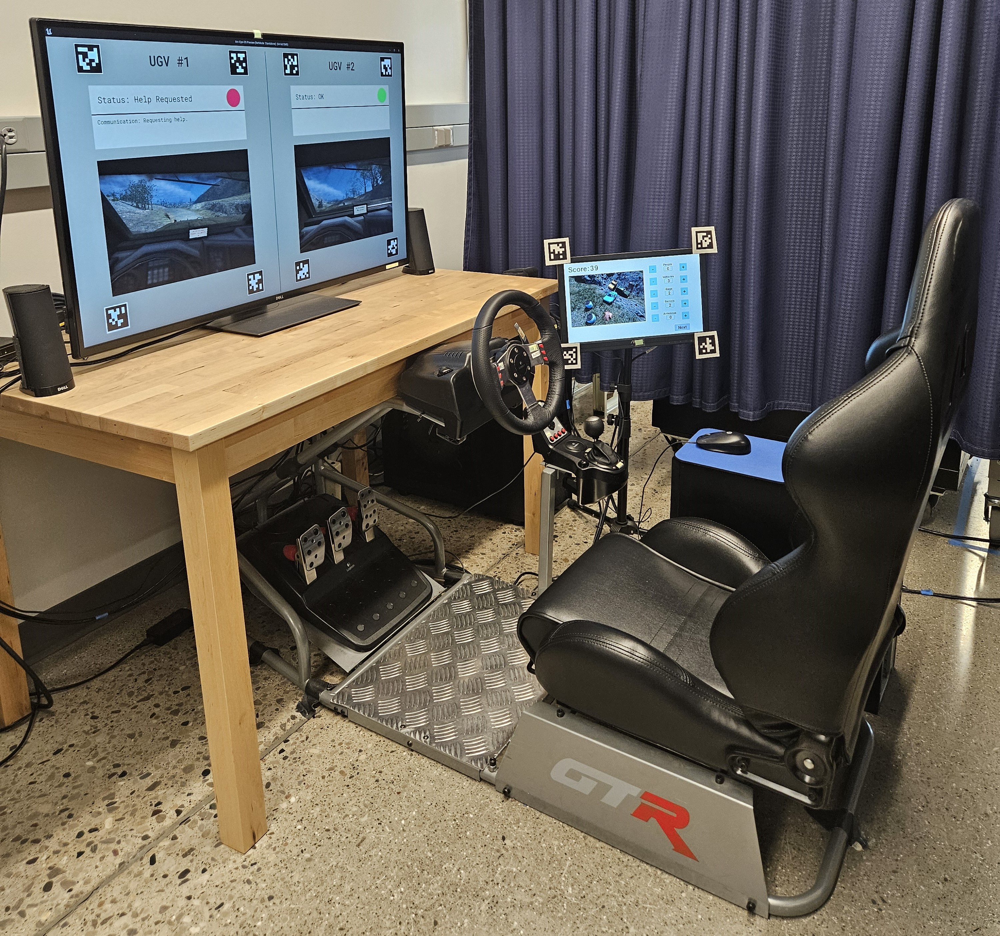

### Career Interests

software and computer engineering, programming, human factors engineering, autonomous vehicles, driver-vehicle interaction, robotics, data analytics, user experience, and related fields

---

### University of Michigan

#### Graduate Research Assistant

#### Ann Arbor, Michigan, USA

#### August 2020 - Present

I have been working with the Michigan Autonomous Vehicle Research Intergroup Collaboration (MAVRIC) as a research fellow. The projects I have worked on are all aimed at improving the interactions between humans and robots, with a special interest in robots as semi-autonomous vehicles. I designed and programmed a reconnaissance mission task with two semi-autonomous vehicles in Unreal Engine, encompassing landscape design, user interface widgets, data logging, vehicle behaviors, and user controls via a driving simulator. I also developed a spot report secondary task using Python and Pygame that involves counting target objects in images. I used these testbeds to lead the investigation of three experiments across 3+ years with a total of 167 subjects to uncover vehicle communication factors that moderate and enhance driver situation awareness to foster safer, more reliable, and intelligent transportation systems. Specifically, I have investigated how a driver's situation awareness can be influenced, estimated in real-time, and calibrated through human-subject user studies. 

I have also developed a task allocation method based on trust to allocate tasks between humans and robots. I have also collaborated with my lab mates to understand how semi-autonomous vehicles can repair trust in a human driver, how a tour guide robot can assess human visitor engagement, and how a security robot can be accepted by human users.

  <iframe align="left" width="430" height="300" src="https://youtube.com/embed/a-3vmqxt8Ls" title="YouTube video player" frameborder="0" allow="accelerometer; autoplay; clipboard-write; encrypted-media; gyroscope; picture-in-picture; web-share" referrerpolicy="strict-origin-when-cross-origin" allowfullscreen></iframe>

    <iframe align="right" width="430" height="300" src="https://youtube.com/embed/TG6cRGQHvJg" title="YouTube video player" frameborder="0" allow="accelerometer; autoplay; clipboard-write; encrypted-media; gyroscope; picture-in-picture; web-share" referrerpolicy="strict-origin-when-cross-origin" allowfullscreen></iframe>

  

  <iframe width="560" height="315" src="https://www.youtube.com/embed/QspkXDuoXUM?si=0SVvwlRvr3I2NIYc" title="YouTube video player" frameborder="0" allow="accelerometer; autoplay; clipboard-write; encrypted-media; gyroscope; picture-in-picture; web-share" referrerpolicy="strict-origin-when-cross-origin" allowfullscreen></iframe>

---

### U.S. Army Research Laboratory

#### Information Science/Humans in Complex Systems Research Intern

#### Aberdeen, Maryland, USA

#### May - August 2024

When I started in this role, I learned of a user experiment that had been conducted in 2023 where data was collected from many sources. My task was to propose a research topic to investigate using the collected data, code scripts to extract measures from the raw data, analyze the data through statistical tests, and write and submit a journal publication on the findings. To start, I read protocols and documents to understand the experiment and reviewed terabytes of data. I iterated on proposing an interesting research topic, until deciding and getting approval to investigate the impact of autonomy on user engagement, trust, and performance in solider platoon teams. The challenge was to find a topic that was narrow enough in scope to feasibly investigate but also broad enough to accurately capture the various unscripted nature and aspects of the experiment, along with avoiding analyzing data that other team members were already looking into. I coded scripts in Python to extract the measures I wanted to analyze, which required cross-referencing different files, aligning timestamps, and accounting for all permutations and edge cases. I learned about and performed linear regressions in SPSS and created plots on the results using MATLAB. During the summer, I also spent 3 weeks participating, observing, and assisting in another ongoing experiment that was being conducted. Towards the end of the internship, I presented a 3-minute thesis style presentation to my division and was advanced as a finalist to represent my division and present at the summer research symposium. After the internship concluded, I continued to write a research paper on the work I was investigating. I wrote a manuscript and upon feedback from my co-authors, I submitted this paper for peer-review and publication in a journal.

---

### Fiat Chrysler Automobiles

#### Software Engineer

#### Auburn Hills, Michigan, USA

#### June - August 2020

In this role, I read documentation and vehicle functionality guidelines for requirements and specifications that needed to be met in future production vehicles. One of the features I worked on was the design and logic behind ambient lighting in a vehicle. This included how vehicle interior lights should respond based on different vehicle door and trunk states, timing, and user input. After reading the specifications, I used model-based design techniques in MATLAB, Simulink, and Stateflow to develop the logic. The design was tested with software-in-the-loop testing and iterated on for improvements.

---

### Inteva Products

#### Latches Advanced Development Intern

#### Troy, Michigan, USA

#### May - August 2018

After my second year of college, I interned at Inteva Products in the Closures product line department, focusing specifically on Latches Advanced Development. I designed, coded, and built an electrical controller to showcase auto reset, power release, and double pull override functionalities in a future-production rear car door electric latch. Auto reset is when the latch system resets after one cable pull, power release is when one pull electrically unlatches, and a double pull override is when two cable pulls unlatches the system. Next, I conducted tests to simulate manual pulling of a handle to monitor heat buildup and time to complete auto reset over thousands of cycles. Furthermore, I developed the electrical controls for cinching a vehicle door from secondary to primary position to ensure passenger safety. At the end of the summer, I showcased my accomplishments to the company's executive leaders with a presentation and software and hardware demonstration.

#### Motors and Electronics Intern

#### Troy, Michigan, USA

#### May - August 2017

After my first year of college, I interned at Inteva Products for the Motors and Electronics product line department. While I was there, I designed a motor conformity matrix with Inteva's top customers to compare Inteva motor capabilities with customer requirements and identified numerous areas for improvement within the motor product line. I also preformed hall effect sensor tests to support a successful design validation test and allow for continuation with product validation testing. Aside from the technical aspects, I was able to understand the responsibilities of an engineer in a professional workplace. At the end of my term, I successfully completed an executive presentation showcasing my accomplishments over the summer.

---

### Oakland University

#### Undergraduate Research Assistant

#### Rochester, Michigan, USA

#### March 2018 - March 2020

I completed my Honors College Thesis with the Embedded Systems Research Lab. Towards understanding how drivers interact and resume control from a highly automated vehicle, I designed and analyzed results from a survey to determine common secondary tasks drivers expect to engage in as vehicle automation progresses. I also constructed a driving simulator and developed an experimental procedure to test how various secondary tasks impact driver resumption of control in highly automated vehicles.

I also built dynamic projects to display in the Engineering Center first floor showcases. These projects were interactive, where a visitor could wave their hand in front of each project and it would activate. One of the projects I built was a delta robot with fine-tuned precision control to stack and unstack ping pong balls in a pyramid formation. I developed the code in Arduino to control movements of the servos, which act as the arms of the robot. A syringe tied to a tube created a suction effect to transport the ping pong balls. I assembled the delta robot initially from wood, and then 3D printed parts for improved accuracy. I implemented improvements, such as smoothening the movements between positions, to gain greater consistency of results. 

Another project I built was ​a PID controller designed to stabilize a ball, move the ball in a circle, and move the ball in a rectangle on a flat plate. A pixy camera is used to detect the position of the colored ball, and this position is read by the Arduino Uno microprocessor. The code uses the error between the current position of the ball and the desired position along with the time between consecutive errors to control servos for the x and y axis attached to the plate. This system utilizes a proportional and a derivative constant. The constants were tuned to obtain the fastest response from the system. The stabilization of the ball was achieved by setting a desired position for the ball. The circular and rectangular movements were achieved by varying the desired position for the ball with time.

  <iframe width="280" height="350" src="https://youtube.com/embed/7bAr-AdT2BM?feature=share" title="YouTube video player" frameborder="0" allow="accelerometer; autoplay; clipboard-write; encrypted-media; gyroscope; picture-in-picture; web-share" referrerpolicy="strict-origin-when-cross-origin" allowfullscreen></iframe>

Another project I worked on was a holiday music box. This system is modeled off of a classic music box. The Holiday Music Box plays the familiar holiday tune of Jingle Bells. A series of photointerrupters are used for each note (A through G) in place of the traditional comb. The photointerrupter consists of a light-emitting element and a light-receiving element. When an object blocks the path between these components, the output voltage changes. To play this song, a piece of foam will pass through each photointerrupter for a specific note. The foam pieces rest on a cylindrical drum that is rotating. As soon as a piece of foam passes between a photointerrupter, a corresponding note is emitted from the buzzer. Each note in the song is mapped to a foam piece and a DC motor is used to rotate the cylinder containing the notes. To achieve an accurate tune, the length for a quarter note and a rest was chosen, and the other notes such as the eighth note, half note, and whole note were made proportional to the length of the quarter note. For an additional visual appeal, I also corresponded an LED to each note that illuminates in sequence with the buzzer.

---
